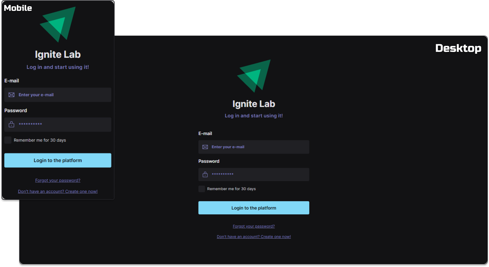

<!--Heading-->
 
<h3 align='center'>
  
</h3>
 

  • <strong>Figma</strong> to <strong>React</strong> - <strong>Design System</strong>

  &nbsp;
  

 
<!--/Heading-->

<!--Section-->
<h4 align='center'>
  ⚙️ Languages and tools used in the project
</h4>

  &nbsp;&nbsp;
  &nbsp;&nbsp;
  &nbsp;&nbsp;
  &nbsp;&nbsp;
	&nbsp;&nbsp;
  

 
<!--/Section-->

<!--Section-->
<h4 align='center'>
  
</4>
<!--/Section-->
